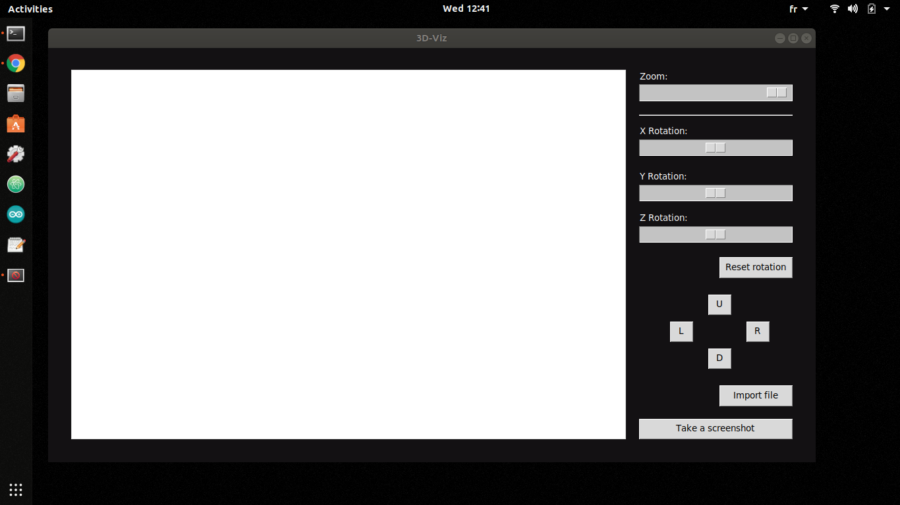

# Build a 3D rendering desktop app from scratch with Python

>[YOUTUBE VIDEO](https://youtu.be/G0m2wwEppWA)

---

## Description

This project was made as a practice for Python programming, matricies manipulation, file processing, and general system engineering processes.

Also it was a way for me to explore an interesting field for me which is graphics (2D, and 3D).

It's a desktop app that takes in waveform files (.OBJ) and visualizes its triangulated form (no filliing, no shading, no texturing! just triangles) and then 

allows the user to rotate the model in the X, Y, and Z directions.

### Key Words

- Python: Numpy, Tkinter, re (regex), PIL.

- Waveform (.OBJ). 

---

## Disclamer

This article assumes having basic knowledge of Python, Tkinter, and Numpy, since these will not be covered here.

---

## Waveform files (.OBJ)

I recommend reading this [article in Wikipedia](https://en.wikipedia.org/wiki/Wavefront_.obj_file) in case you want to know more about the structure of these 

files.

Or if you're not into reading, watch this [YouTube video](https://www.youtube.com/watch?v=KMWUjNE0fYI) that provides a good enough explanation.

---

## How to use

### Dependecies:

You'll have to have these libraries along with Python in your PC:

- Numpy

- Tkinter (if you're running Linux, you'll have to install it, otherwise, it comes with Python when installed)

- The 3 files provided in this repo located in the same folder. (main.py, geometry_set.py, obj_files_handler.py)

- pyscreenshot (Only if you're running Linux, otherwise, you can import ImageGrab directly from PIL)

### Manipulation

- Run the main.py file

- This interface will open:

- You can load any .obj file you want, or you can choose from the files 
provided in the /Objects folder.

- After loading the 3D model, you can move it UP/DOWN/LEFT/RIGHT using the U/D/L/R buttons or using the arrow keys on your keyboard.

- You can zoom in and out, or rotate the model in 3 axis.

- You can take screenshots too with the "Take screenshot" button.

---

## Possible improvements

 - Migrate this code into an OOP (Object Oriented Programming) approach and ditch the use of global variables.

 - In the current approach, I'm drawing the triangles line by line by calling the DrawLine() function 3 times. This chould be improved by making a DrawTriangle() function that draws one triangle at the time.
 
 - Test more files and study more waveform files in order to be sure that this app will read any waveform file (I didn't do much testing).
  
 - Add the filling, shading, and textures to the objects.

---

## References

- Inspiration for this project: [YouTube video](https://www.youtube.com/watch?v=Scn96t7mwC4).

- Some of my code was based on this work: [YouTube video](https://www.youtube.com/watch?v=sSQIwIx8uT4).

- Best explanation of linear algebra ever: [YouTube playlist](https://www.youtube.com/playlist?list=PLZHQObOWTQDPD3MizzM2xVFitgF8hE_ab).

- Get free waveform files online: [Link](https://www.turbosquid.com/Search/3D-Models/free/obj)

---

## Author info

[Linkedin](https://www.linkedin.com/in/radhi-sghaier/)

## Modifications

ES-Alexander:
- make better use of numpy's vectorisation to transform and project all points in an object
- reuse calculation results (e.g. rotation matrix) instead of recalculating per point
- simplify drawing functions with better use of tkinter functions
- minor structural cleanup for improved readability
- TODO: refactor program to be class-based and simplified
